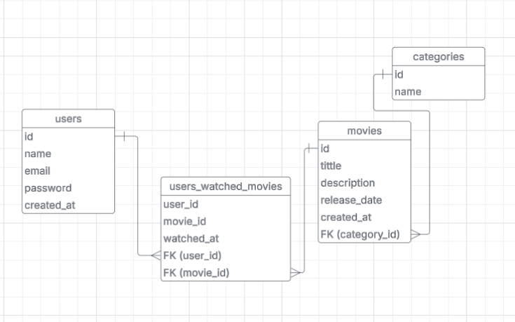

# RELATIONAL DB MODEL:
´´´
    
´´´

## Cuestionario técnico

### ¿Cuál es el propósito de "module.exports"?
`module.exports` se usa para exportar funciones, objetos o variables desde un archivo, permitiendo que otros archivos puedan importarlos con `require()`. Esto facilita la modularización del código.

Ejemplo:
```js
...
module.exports = router;
```

```js
const routerBase = require("./src/routes/routes");
app.use("/movies/", routerBase);
```

---

### ¿Qué es un middleware?
un middleware aquella función que se ejecuta antes de llegar a un route o controller. Puede modificar la solicitud (`req`), la respuesta (`res`) o pasar el control a otro middleware con `next()`.

Ejemplo de un middleware de autenticación:
```js
const validateJwt = async (req, res, next) => {
  console.log("running validateJwt...");

  const authHeader = req.headers['authorization'];

  if (!authHeader || !authHeader.startsWith('Bearer ')) {
    console.log("invalid token");
    return res.status(401).json({ error: 'Unauthorized, token required' });
  }

  const token = authHeader.split(' ')[1];

  try {
    const decodedToken = jwt.verify(token, process.env.JWT256);
    req.userId = decodedToken.id;
    console.log("valid token, user created successfully");
    next();
  } catch (error) {
    console.log("invalid token");
    return res.status(401).json({ error: 'Invalid token' });
  }
};


// en routes (se usa el validateJwt para el endpoint):
router.get('/movies', validateJwt, filterMovies);
```

---

### ¿Cuál es la diferencia entre código bloqueante y código no bloqueante?
- **Código bloqueante:** No continua ejecutando el codigo hasta que una tarea sea completada.
- **Código no bloqueante:** Continua ejecutando el codigo y haciendo operaciones mientras la tarea se ejecuta en segundo plano

Ejemplo:

**Bloqueante:**
```js
// (codigo extraido de backend/src/controllers/register.js)
const salt = bcrypt.genSaltSync(10);
const hashedPassword = bcrypt.hashSync(password, salt);

```

**No bloqueante:**
```js
const connection = await db;
const [existingUser] = await connection.query('SELECT email FROM users WHERE email = ?', [email]);
```

---

### ¿Qué biblioteca de JavaScript usaría para manejar datos en tiempo real?
una bastante comun que he visto en algunos proyectos es **Socket.io**,  facilita la comunicación bidireccional en tiempo real entre el servidor y los clientes mediante WebSockets

Ejemplo de uso:
```js
const io = require('socket.io')(server);
io.on('connection', (socket) => {
    console.log('Usuario conectado');
    socket.on('mensaje', (data) => {
        console.log('Mensaje recibido:', data);
        io.emit('mensaje', data); 
    });
});
```


